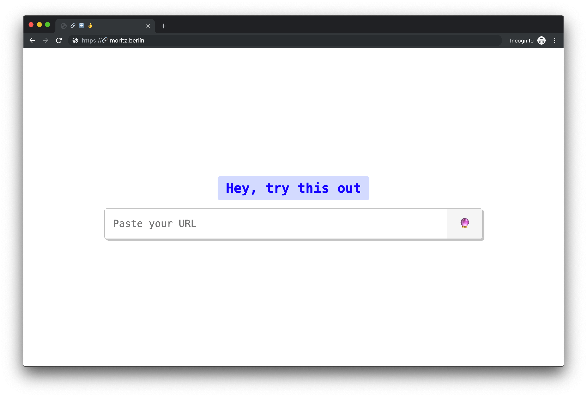

# 🔗
> URL to random emoji sequency.

## Why?

This is just a technical concept for me to learn new technologies, namely:

- Modules `.mjs` in Node.js via `--experimental-modules`
- MongoDB
- Punycode domains (`https://🔗.moritz.berlin`)
- Deploying to a service I haven't used in a while
